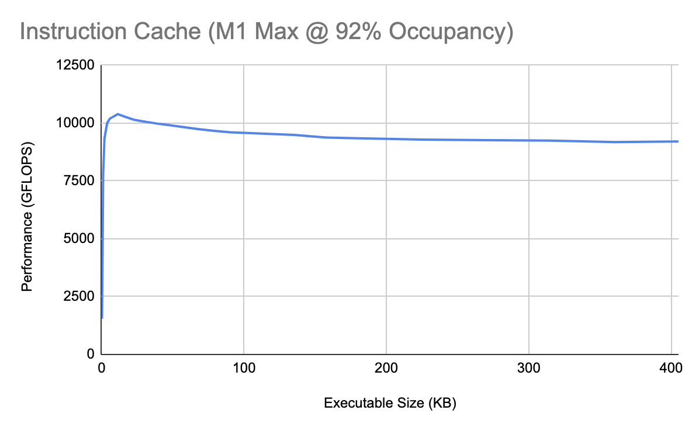
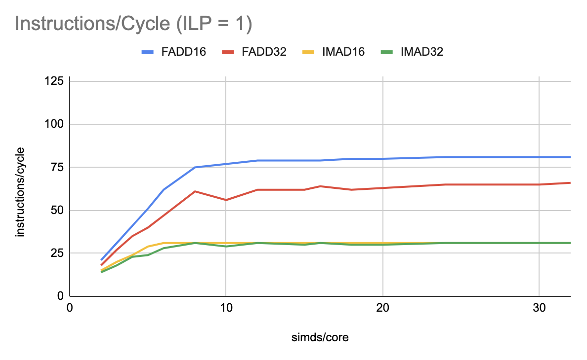
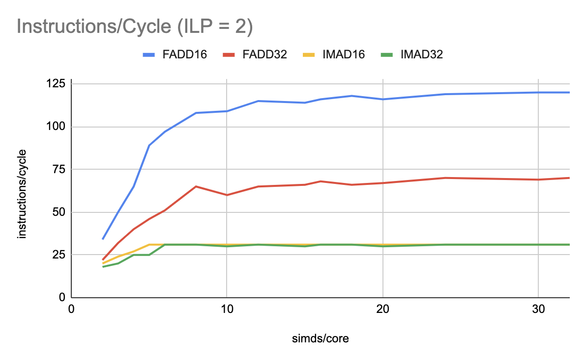
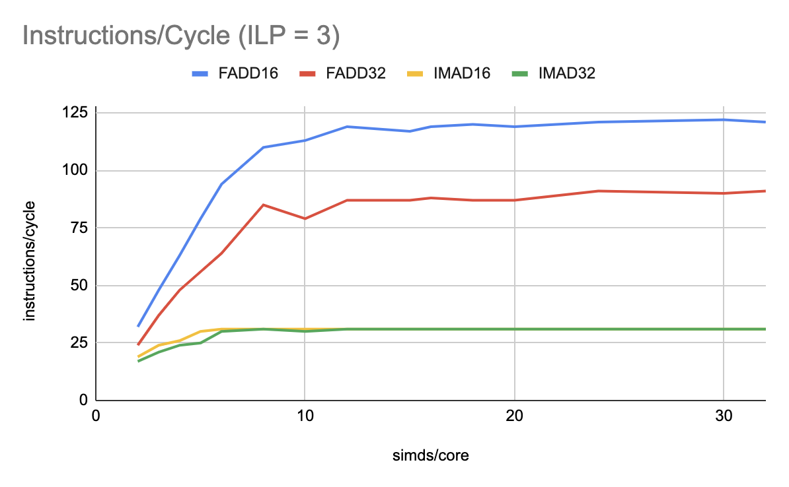
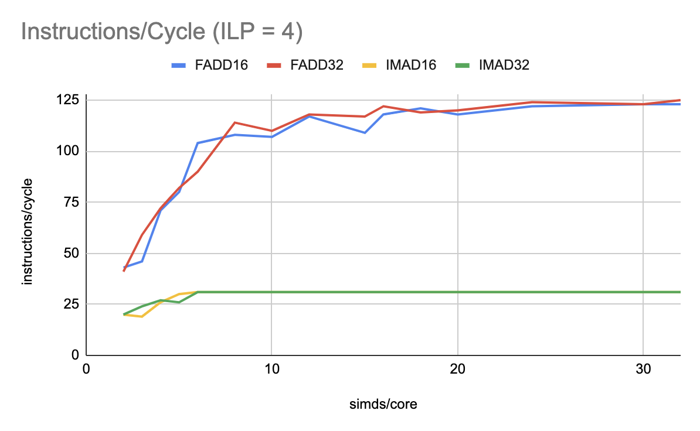
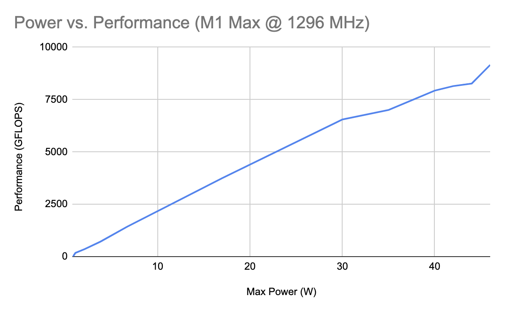

# Metal Benchmarks

This document thoroughly explains the Apple GPU microarchitecture, focusing on its GPGPU performance. Details include latencies for each ALU assembly instruction, cache sizes, and the number of unique instruction pipelines. This document enables evidence-based reasoning about performance on the M1 GPU, helping people diagnose bottlenecks in real-world software. It also compares the M1 to generations of AMD and Nvidia microarchitectures, showing where it might exhibit different performance patterns. Finally, the document examines how Apple's design choices improve power efficiency compared to other vendors.

This repository also contains open-source benchmarking scripts. They allow anyone to reproduce and verify the author's claims about performance.

<details>
<summary>Overview of Apple-designed GPUs</summary>

| Apple GPU | Generation | Clock Speed | Cores | GFLOPS F32 | GFLOPS F16 | GOPS I16/I32 |
| --------- | ---------- | ----------: | ----: | ---------: | ---------: | -----------: |
| A14 | Apple 7 | 1278 MHz | 4 | 654 | 1309 | 654 |
| M1 | Apple 7 | 1278 MHz | 8 | 2617 | 2617 | 1309 |
| M1 Pro | Apple 7 | 1296 MHz | 16 | 5308 | 5308 | 2654 |
| M1 Max | Apple 7 | 1296 MHz | 32 | 10620 | 10620 | 5308 |
| M1 Ultra | Apple 7 | 1296 MHz | 64 | 21230 | 21230 | 10620 |
| A15 | Apple 8 | 1336 MHz | 5 | 1710 | 1710 | 855 |
| M2 | Apple 8 | 1398 MHz | 10 | 3579 | 3579 | 1789 |
| A16 | Apple 8 | &ge;1336 MHz | 5 | &ge;1710 | &ge;1710 | &ge;855 |
| M2 Pro | Apple 9 | &ge;1398 MHz | 18-20 | &ge;6441 | &ge;6441 | &ge;3221 |
| M2 Max | Apple 9 | &ge;1398 MHz | 38 | &ge;13600 | &ge;13600 | &ge;6800 |
| M2 Ultra | Apple 9 | &ge;1398 MHz | 76 | &ge;27200 | &ge;27200 | &ge;13600 |

_The M2 Pro and later statistics come from recent leaks from Apple's supply chain. They will be updated whenever new information comes out._

</details>

Table of Contents
- [On-Chip Memory](#on-chip-memory)
- [Operations per Second](#operations-per-second)
- [ALU Bottlenecks](#alu-bottlenecks)
- [ALU Layout](#alu-layout)
- [Instruction Throughputs](#instruction-throughputs)
- [Power Efficiency](#power-efficiency)
- [References](#references)

## On-Chip Memory

| Per Core | Apple 7, 8 | GCN 5 | RDNA 1, 2 | RDNA 3 | Pascal | Turing | Ampere, Ada |
| -------- | ------- | ----- | --------- | ------ | ------ | ------ | ----------- |
| Max Threads | 768-3072 | 256-2560 | 256-2560 | 384-TBD | 256-2048 | 256-1024 | 256-1536 |
| Register File | 384 KB | 256 KB | 256 KB | 384 KB | 256 KB | 256 KB | 256 KB |
| Shared Memory | 64 KB | 64 KB | 128 KB | 128 KB | 96 KB | 32-64 KB | 8-100 KB |
| L1 Instruction Cache | 12 KB | 32 KB | 32 KB | 32 KB | 8 KB | 12 KB | 32 KB |
| L1 Data Cache | ~8-12 KB | 16 KB | 16 KB | 32 KB | 24-48 KB | 32-64 KB | 28-128 KB |



## Operations per Second

The A14 and M1 come from the Apple 7 GPU family. However, the A14 core has half the FP32 processing power. A few months before the M1 launched, Nvidia's Ampere GPUs doubled FP32 performance while keeping everything else constant. _<b> This event likely inspired Apple to take the same approach.</b>_ It happened early enough in the chip design process for Apple to revise the M1 architecture, but probably not the A14. _<b>The original design was optimized for FP16, explaining why the M1's extra FP32 power is notoriously underutilized.</b>_

Future chips will likely retain the same ratio of F32:F16:I32 compute power (most vendors recently converged on 256 FP32 OPs/clock). The microarchitecture may become mostly "frozen" as Moore's Law grinds to a halt. Future improvements will include hardware-accelerated ray tracing, but not tensor cores. Apple's "tensor core" is the `simdgroup_matrix` instruction, which improves ALU utilization of existing FP32 pipelines (M1+) and FP16 pipelines (A14). AI advancements could continue in the Neural Engine, such as FP8.

| Per Core | A14 | M1, A15 | GCN 5 | RDNA 1, 2 | RDNA 3 | Pascal | Turing | Ampere, Ada |
| -------- | ------- | ------- | ----- | --------- | ------ | ------ | ------ | ----------- |
| F16 OPs/Clock | 256 | 256 | 256 | 256 | 512 | 4 | 256 | 256 |
| F32 OPs/Clock | 128 | 256 | 128 | 128 | 256 | 256 | 128 | 256 |
| F64 OPs/Clock | 0   | 0   | 8   | 8   | 16  | 8   | 4   | 4   |
| F16 IPC | 128 | 128 | 128 | 128 | 256 | 2 | 128 | 128 |
| F32 IPC | 64 | 128 | 64 | 64 | 128 | 128 | 64 | 128 |
| F64 IPC | 0 | 0 | 4 | 4 | 8 | 4 | 2 | 2 |
| Transcendental IPC | 16-32 | 16-32 | TBD | 16 | TBD | 32 | 16 | 16 |

_On Nvidia chips, all major transcendentals take the same amount of time. On Apple chips, throughput depends on the operation._

| Per Core | Apple 7, 8 | GCN 5 | RDNA 1, 2 | RDNA 3 | Pascal | Turing | Ampere, Ada |
| -------- | ------- | ----- | --------- | ------ | ------ | ------ | ----------- |
| I16 OPs/Clock | 128 | 256 | 256 | 512 | 0 | 0 | 0 |
| I32 OPs/Clock | 128 | 128 | 128 | 256 | 128 | 128 | 128 |
| I64 OPs/Clock | 32 | 32 | 32 | 64 | 0 | 0 | 0 |
| I16 IPC | 128 | 128 | 128 | 256 | 256 | 0 | 0 | 0 |
| I32 IPC | 128 | 64 | 64 | 128 | 128 | 64 | 64 |
| I64 IPC | 32 | 16 | 16 | 32 | 0 | 0 | 0  |
| I32 Adds/Clock | 128 | 64 | 64 | 128 | 128 | 64 | 64 |
| I32 Muls/Clock | 32 | 64 | 64 | 128 | 0 | 64 | 64 |
| I64 Adds/Clock | 32 | 16 | 16 | 32 | 0 | 0 | 0 |
| I64 Muls/Clock | 8 | 16 | 16 | 32 | 0 | 0 | 0 |

_IPC stands for instructions per clock. Integer IPC consists of adds and/or fused multiply-adds, in whatever combination is fastest. Integer compare-select, which is two operations in one instruction, doesn't count._

## ALU Bottlenecks

In low-occupancy situations, or situations with heavy register dependencies, F16/I16 is significantly faster than F32/I32. For back-to-back dependent FMUL, there's a 0.84-cycle throughput penalty for a 32-bit register dependency (1.84 total). When switching to a 16-bit register, that's a 0.56-cycle throughput penalty (1.56 total). In a minimum-occupancy situation, combined latencies are 6.6 and 3.9 cycles. The gap widens to 11.3 vs 3.9 for low-occupancy FMA. Now it makes sense why Apple pushes for half-precision in Metal.

> These tables reflect a sub-optimal shader setup. Later benchmarks reduced the absolute latency to 3 cycles (FFMA16, FADD32, FMUL32) and 6 cycles (FFMA32).

<details>
<summary>Tables for FMUL, FADD, IADD, FFMA</summary>

| ILP | Occupancy | Instruction | F32/I32 Cycles | F16/I16 Cycles |
| - | - | - | - | - |
| 1 | 4 simds/core | FMUL, FADD, IADD | 6.60 | 3.92 |
| 2 | 4 simds/core | FMUL, FADD, IADD | 5.59 | 2.49 |
| 3 | 4 simds/core | FMUL, FADD, IADD | 5.14 | 2.55 |
| 4 | 4 simds/core | FMUL, FADD, IADD | 2.86 | 1.78 |
| 1 | 8 simds/core | FMUL, FADD, IADD | 3.44 | 2.16 |
| 2 | 8 simds/core | FMUL, FADD, IADD | 3.08 | 1.46 |
| 3 | 8 simds/core | FMUL, FADD, IADD | 2.78 | 1.47 |
| 4 | 8 simds/core | FMUL, FADD, IADD | 1.58 | 1.26 |
| 1 | 88 simds/core | FMUL, FADD, IADD | 1.84 | 1.56 |
| 2 | 88 simds/core | FMUL, FADD, IADD | 1.73 | 1.05 |
| 3 | 88 simds/core | FMUL, FADD, IADD | 1.37 | 1.04 |
| 4 | 88 simds/core | FMUL, FADD, IADD | 1.01 | 1.02 |

_ILP stands for instruction-level parallelism. It is the number of operations you could theoretically execute in parallel, on a superscalar processor._

| ILP | Occupancy | Instruction | FP32 Cycles | FP16 Cycles |
| - | - | - | - | - |
| 1 | 4 simds/core | FFMA | 11.34 | 3.94 |
| 2 | 4 simds/core | FFMA | 8.36 | 2.44 |
| 3 | 4 simds/core | FFMA | 4.46 | 2.55 |
| 4 | 4 simds/core | FFMA | 2.75 | 1.79 |
| 1 | 8 simds/core | FFMA | 5.71 | 2.15 |
| 2 | 8 simds/core | FFMA | 4.24 | 1.40 |
| 3 | 8 simds/core | FFMA | 2.75 | 1.47 |
| 4 | 8 simds/core | FFMA | 1.60 | 1.29 |
| 1 | 88 simds/core | FFMA | 1.99 | 1.56 |
| 2 | 88 simds/core | FFMA | 1.87 | 1.04 |
| 3 | 88 simds/core | FFMA | 1.35 | 1.04 |
| 4 | 88 simds/core | FFMA | 1.02 | 1.02 |

</details>

The graphs below depict scalar instructions per cycle across the entire compute unit. This metric relates to the reciprocal of amortized cycles/instruction (throughput). FADD, FMUL, FFMA, and IADD have the same latency/throughput characteristics. As long as FFMA is performed as `(x * y) + y`, it will only have two register dependencies. In this situation only, it behaves similarly to `FADD`.

|  |  |
| - | - |
|  |  |

## ALU Layout

Apple described each GPU core as having 128 ALUs. These generally correspond to all the pipelines necessary to sustain one scalar instruction/cycle. Integer pipelines process both I32 and U32 with the same latency. Most pipelines can accept 16-bit operands or write 16-bit results, with zero additional cost. The Apple GPU has schedulers capable of:

- single-dispatching from &ge;3 simds
- dual-dispatching from 2 simds
- triple/quadruple-dispatching from 1 simd

Single-dispatching only occurs at ILP=1 for 16-bit data types. Dual-dispatching is the preferred approach at low occupancy and/or low ILP, and required to fully utilize FP16/I16. Quadruple-dispatching is probably lower-power, and required to fully utilize FP32/I32. Many workloads can work fine in this mode; the complex pipeline runs one instruction/simd every 4 cycles. This can be reformulated as one instruction/4 simds every 1 cycle.

> As a reminder, the additional 32-bit pipelines on Ampere GPUs struggle to be fully utilized. Apple's dual-dispatch from 2 simds mode is a remnant of the PowerVR architecture. It could only execute F32 instructions at 2 IPC anyway, so what's the point in dispatching from 4 simds concurrently? This scheme prevents fully utilizing I32 instructions (except when ILP=4), but GPU workloads are predominantly F32. It failed spectacularly when F32 got upgraded to 4 IPC of compute power.

On A14, we likely have separate F16 and F32 pipelines. This reflects how Metal Frame Capture shows separate statistics for "F16 utilization" and "F32 utilization". It also reflects Apple's statement of "twice the F32 pipelines" in their A15 video. This scheme utilizes mixed-precision F16/F32 compute similar to RDNA 2 (the F32 pipelines [provide half the total](https://www.realworldtech.com/forum/?threadid=197759&curpostid=197993) F16 power via emulation). We omit the A14 design for simplicity.

---

FP32, integer and conditional pipeline:
- Only one sub-pipeline simultaneously utilized.
- 4 cycles: F/IADD32 fusable with LSHIFT32(k=1-4)
- 4 cycles: F/ICMPSEL16, F/ICMPSEL32
- 4 cycles: BITWISE32
- 4 cycles: FMUL/FFMA16, FMUL/FFMA32

FP32, integer and conditional pipeline:
- Only one sub-pipeline simultaneously utilized.
- 4 cycles: F/IADD32 fusable with LSHIFT32(k=1-4)
- 4 cycles: F/ICMPSEL16, F/ICMPSEL32
- 4 cycles: BITWISE32
- 4 cycles: FMUL/FFMA16, FMUL/FFMA32

FP32, integer and conditional pipeline:
- Only one sub-pipeline simultaneously utilized.
- 4 cycles: F/IADD32 fusable with LSHIFT32(k=1-4)
- 4 cycles: F/ICMPSEL16, F/ICMPSEL32
- 4 cycles: BITWISE32
- 4 cycles: FMUL/FFMA16, FMUL/FFMA32

FP32, integer and conditional pipeline:
- Only one sub-pipeline simultaneously utilized.
- 4 cycles: F/IADD32 fusable with LSHIFT32(k=1-4)
- 4 cycles: F/ICMPSEL16, F/ICMPSEL32
- 4 cycles: BITWISE32
- 4 cycles: FMUL/FFMA16, FMUL/FFMA32

Integer and complex math pipeline:
- Only one sub-pipeline simultaneously utilized.
- 4 cycles: IMAD32\*
- 8 cycles: IMUL(32x32=64)
- 4 cycles: LSHIFT32, BITEXTRACT32, BITREV32, POPCOUNT32
- 4 cycles: CONVERT(F->I), CONVERT(I->F), RINT, FRACT
- 4 cycles: EXP2, LOG2
- 6 cycles: RECIP
- 8 cycles: RSQRT
- 10 cycles: SIN_PT_1 + SIN_PT_2

\* You might imagine a way to exceed 128 Int OPs/cycle/core. Issue an IMAD32, then 3 subsequent IADD32 instructions. That would be 5 adds/multiplies issued in 4 cycles (160/cycle/core). However, this scheme does not work in practice. Perhaps the add part of IMAD32 occupies one of the dedicated IADD32 pipelines.

---

Vocabulary Note: Concurrency means the number of times each pipeline's circuitry is physically duplicated. For example, a 4-cycle operation needs 4 pipelines/ALU to reach 1 cycle/instruction throughput.

> Little's Law: Concurrency = Latency / Throughput
> 
> Cycles Throughput = Cycles Latency / (Pipelines/ALU)

## Instruction Throughputs

Throughput and latency are measured in cycles. If listed with a comma, throughputs were tested on multiple chips (A14, M1 Max). Latencies are recorded in two forms separated by a dash. First, half the best recorded throughput at 2 simds/core and ILP = 1. Second, the best recorded throughput at 4 simds/core and ILP = 1. The second is the most accurate. To find accurate latencies, benchmarks issue 250x the amount of work needed to fully occupy a core's register file.

<details>
<summary>Control group (calibration)</summary>

| No Operations | Throughput | Virtual Repetitions |
| ------- | ---------- | ----- |
| 2-4 simds, 16-bit | &ge;1.17 | 1440 |
| 2-4 simds, 16-bit | &ge;2.34 | 720 |
| 2-4 simds, 16-bit | &ge;4.68 | 360 |
| 2-4 simds, 16-bit | &ge;7.02 | 240 |
| 2-4 simds, 16-bit | &ge;14.04 | 120 |
| 2-4 simds, 32-bit | &ge;1.27-1.70 | 1440 |
| 2-4 simds, 32-bit | &ge;3.40 | 720 |
| 2-4 simds, 32-bit | &ge;6.80 | 360 |
| 2-4 simds, 32-bit | &ge;10.20 | 240 |
| 2-4 simds, 32-bit | &ge;13.60 | 120 |

_At a minimum, the numbers above should be subtracted from measured latencies. However, the original raw latencies will be presented in the tables._

</details>

<details>
<summary>Floating-point performance</summary>

| Float Instruction | Throughput | Raw Latency | Adjusted Latency |
| -------------------------- | ------ | ------- | ------- |
| FADD16 | 1, 1 | 2.97-3.33 | 2.16 |
| FMUL16 | 1, 1 | 2.98-3.34 | 2.17 |
| FFMA16 | 1, 1 | 2.97-3.35 | 2.18 |
| FADD32 | 2, 1 | 3.50-3.90 | 2.20 |
| FMUL32 | 2, 1 | 3.50-3.91 | 2.21 |
| FFMA32 | 2, 1 | 3.50-3.91 | 2.21 |
| CONVERT(F->I32) | 4 | 3.78-5.36 | 3.66 |
| RINT32 | 4 | 3.78-5.36 | 3.66 |
| TRUNC32 | 4 | TBD | ~4 |
| RECIP16 | 6 | TBD | 6.50 |
| RECIP32 | 6 | 5.80-8.20 | 6.50 |
| RSQRT16 | 8, 8 | 7.11-9.78 | 8.61 |
| RSQRT32 | 8, 8 | 7.13-10.69 | 8.99 |
| Precise RSQRT32 | 8, 8 | 7.13-10.69 | 8.99 |
| SIN_PT_1 | &lt;10 | TBD | &lt;10 |
| SIN_PT_2 | &lt;10 | TBD | &lt;10 |
| EXP2_16 | 4.00 | 5.38-5.79 | 4.62 |
| LOG2_16 | 4.00 | 5.38-5.79 | 4.62 |
| EXP2_32 | 4.00 | 5.38-6.01 | 4.31 |
| LOG2_32 | 4.00 | 5.36-6.01 | 4.31 |
| Precise EXP2_32 | 4.00 | 5.38-6.01 | 4.31 |
| Precise LOG2_32 | 4.00 | 5.38-6.01 | 4.31 |
| FMAX32 | 1, 1 | 6.11-6.44 | 4.74 |
| FMIN32 | 1, 1 | 6.11-6.44 | 4.74 |
| FCMPSEL16 | 1, 1 | 2.98-3.34 | 2.17 |
| FCMPSEL32 | 1, 1 | 6.11-6.44 | 4.74 |

| Instruction Sequence | Throughput | Raw Latency | Optimal Repetitions |
| -------------------------- | ------ | ------- | ---- |
| CONVERT(F->I64) | 7.11 | 10.30-12.67 | 240 |
| FRACT32 | 4.00 | 5.94-7.07 | 960 |
| FREXP | TBD | TBD | TBD |
| ROUND_INF | 8.18 | 20.98-21.38 | 240 |
| FMEDIAN16 | 6.54 | 15.00-16.41 | 120-240 |
| FMEDIAN32 | 3.65 | 9.20-10.86 | 360-480 |
| DIV16 | 6.01 | 8.58-9.36 | 960 |
| DIV32 | 6.01 | 7.62-8.90 | 960 |
| SQRT16 | 8 | 9.56-10.74 | 960 |
| SQRT32 | 8 | 8.57-11.13 | 960 |
| SIN16 | 13.56 | 23.78-27.90 | 240 |
| SINPI16 | 18.64 | 34.42-39.47 | 120-240 |
| SIN32 | 14.28 | 23.04-27.35 | 240 |
| COS32 | 14.28 | 23.04-27.35 | 240 |
| SINPI32 | 25.03 | 52.58-56.44 | 48-72 |
| EXPE_32 | 4.00 | 7.61-7.66 | 960 |
| LOGE_32 | 4.00 | 7.61-7.66 | 960 |
| EXP10_32 | 4.00 | 7.61-7.66 | 960 |
| LOG10_32 | 4.00 | 7.61-7.66 | 960 |
| Precise RECIP32 | 10.46 | 24.99-28.48 | 120 |
| Precise DIV32 | &le;30.65 | TBD | 48 |
| Precise SQRT32 | 15.03 | 34.27-37.12 | 72 |
| Precise SIN32 | 24.39 | 224.42-225.66 | 240 |
| Precise SINPI32 | 29.08 | 56.16-64.09 | 48 |

| Instruction Sequence | Actual Instructions |
| -------------------------- | ------ |
| DIV32 | RECIP32 + FMUL32 |
| FRACT32 | TRUNC32 + FADD32 |
| TRIG_REDUCE | FMUL32 + FRACT32 + FFMA32 |
| SIN32 | TRIG_REDUCE + SIN_PT_1 + SIN_PT_2 |
| COS32 | TRIG_REDUCE + SIN_PT_1 + SIN_PT_2 |

</details>

<details>
<summary>Integer performance</summary>

| Int Instruction | Throughput | Raw Latency | Adjusted Latency |
| -------------------------- | ------ | ------- | ---- |
| IADD16 | 1, 1 | 2.97-3.34 | 2.17 |
| IMUL16 | 4, 4 | 4.20-5.39 | 3.69 |
| IMAD16 | 4, 4 | 4.18-5.38 | 3.68 |
| IMUL(16x16=32) | 4 | 4.14-5.56 | 3.86 |
| IMAD((16x16=32)+32) | 4 | 4.34-5.67 | 3.97 |
| IADD32 | 1, 1 | 3.51-3.91 | 2.21 |
| IMUL32 | 4, 4 | 4.30-5.72 | 4.02 |
| IMAD32 | 4, 4 | 4.30-5.72 | 4.02 |
| IMULHI32 | 8.01 | 10.59-11.53 | 9.83 |
| IMUL(32x32=64) | 8.01 | 10.59-11.54 | 9.84 |
| IADDSAT32 | 1.02 | 3.53-3.92 | 2.75 |
| BITEXTRACT32\* | 4.01 | 4.30-5.72 | 4.02 |
| BITINSERT32\*\* | &le;4.42 | TBD | TBD |
| BITWISE32 | 1.06 | TBD | TBD |
| BITREV32 | 4.00 | 3.76-5.32 | 3.62 |
| POPCOUNT32 | 4.00 | 3.76-5.32 | 3.62 |
| IMAX32 | 1, 1 | 6.11-6.44 | 4.74 |
| IMIN32 | 1, 1 | 6.11-6.44 | 4.74 |
| ICMPSEL16 | 1, 1 | 2.98-3.34 | 2.17 |
| ICMPSEL32 | 1, 1 | 6.11-6.44 | 4.74 |

_\* BITEXTRACT32 must extract a number of bits known at compile-time. Otherwise, throughput is 8 cycles. For BITINSERT32, the offset must be known at compile-time. Creating the offset dynamically worsens throughput to ~8 cycles. Creating the number of bits dynamically worsens throughput to ~12 cycles, regardless of how the offset is created._

_\*\* Based on results of the instruction sequence BITINSERT32 + ADD32, BITINSERT32 might not be a unique instruction. This conclusion conflicts with Dougall Johnson's [G13 GPU reference](https://dougallj.github.io/applegpu/docs.html). I cannot set up a proper benchmark without the compiler optimizing everything away._

| Instruction Sequence | Throughput | Raw Latency | Optimal Repetitions |
| -------------------------- | ------ | ------- | ----- |
| IMADHI16 | 4 | 6.23-7.29 | 720 |
| BITWISE32 + ADD32 | 2.11 | 5.56-6.44 | 720 |
| BITINSERT32 + ADD32 | 4.42 | 9.56-10.23 | 240-360 |
| BITREV16 | 4 | 5.76-6.76 | 480 |
| BITROTATE32 | 8.20 | 22.84-22.70 | 720-1440 |
| RHADD16 | 4 | 15.65-16.42 | 480 |
| RHADD32 | 6 | 18.96-20.89 | 240 |
| CLZ32 | 4.05 | 7.67-9.33 | 480-960 |
| LSHIFT32\* | 4.01 | 5.56-6.74 | 720 |
| RSHIFT32\* | 7.89 | 10.80-12.19 | 720 |
| ABSDIFF32 | 4.03 | 8.27-9.97 | 480-1440 |
| IADD(32+32=64) | 3.07 | 6.89-7.86 | 480 |
| IADD(64+32=64) | 3.30 | 9.63-9.78 | 360-480 |
| IADD(64+64=64) | 4.68 | 10.01-11.62 | 360 |
| IMUL(64x64=64) | 16.06 | 15.18-21.72 | 240 |
| IMADHI32 | 8.01 | 9.04-11.61 | 720 |
| IMAD((32x32=32)+64) | 4.80 | 11.21-12.26 | 360 |
| IMAD((32x32=64)+64) | 8.03 | 19.04-19.85 | 720-960 |
| IMAD((64x64=64)+64) | 16.58 | 21.32-25.94 | 180 |
| IMULHI64 | 22.22 | 37.87-45.32 | &le;120 |

_\* When the shift amount is unknown at compile time, LSHIFT32 and RSHIFT32 appear like multi-instruction sequences according to the 12 KB instruction cache. I cannot specify a constant amount without the compiler optimizing it away._

| Instruction Sequence | Actual Instructions |
| -------------------------- | ------ |
| IMADHI16 | IMUL32 + REG_MOVE\* |
| IADD(32+32=64) | IADD32 + ICMPSEL32\* + IMMEDIATE_MOVE32 |
| IADD(64+32=64) | IADD32 + ICMPSEL32 + IADD32 |
| IADD64 | IADD32 + ICMPSEL32 + IADD32 + IADD32 |
| IMUL64 | ~6 instructions |
| IMAD64 | ~8 instructions |
| IMULHI64 | &ge;12 instructions |

_\* Register move may be implemented through an instruction that adds zero._

_\* To check for overflow, you only need one integer comparison. The overflowed sum is always smaller than either input._

</details>

<details>
<summary>64-bit integer math</summary>

According to the Metal Feature Set Tables, the A11 and later have "64-bit integer math". It turns out that Apple has hardware-accelerated 64-bit integer multiplication and addition. It takes ~4 cycles to add two 64-bit integers, the same time it would take to emulate through 32-bit. However, requiring a single assembly instruction reduces executable size. The IADD64 pipeline seems to interfere with the FADD32/IADD32 pipeline in the following way:

> Throughput &ge; 4(number IADD64s) + 1(number IADD32s) + 1(number FADD32s)

Furthermore, it runs partially concurrently to IMUL32 - combined, the operations have better throughput than in isolation. This suggests that IADD64 hijacks the IADD32 pipeline to perform segments of the IADD64 addition. The FADD32 pipeline also uses this circuitry to add floating point mantissas.

With 4 cycles for IMAD32 and 8 cycles for IMAD((32x32=64)+64=64), emulating IMUL64 would take 20 cycles. Hardware performs this in 16 cycles, and is therefore native. This may be slower than emulation on AMD, where IMAD32 takes 1 cycle. Regarding mixed-precision IMUL, MUL(32x32=64) only takes 8 cycles with the following Metal code. Do not explicitly split it into MUL32 and MULHI32, which takes 12 cycles. A 64-bit addition can also be fused into this multiply, at no additional cost.

```metal
// 12 cycles - don't do this.
ulong naive_mul32x32_64(uint x, uint y) {
  uint lo = x * y;
  uint hi = mulhi(x, y);
  return as_type<ulong>(uint2(lo, hi));
}

// 8 cycles
ulong mul32x32_64(uint x, uint y) {
  return ulong(x) * ulong(y);
}

// 12 cycles
ulong mul64x32_64(ulong x, uint y) {
  return x * ulong(y);
}

// 16 cycles
ulong mul64x64_64(ulong x, ulong y) {
  return x * y;
}
```

</details>

<details>
<summary>Mixed workload performance</summary>

| Instruction Sequence | Throughput |
| -------------------------- | ------ |
| 4 FADD/FFMA/IADD16 | 4.12 |
| 4 FADD/FFMA/IADD32 | 4.12 |
| 2 IADD32 + 2 IADD16 | 4.16 |
| 2 FADD/FFMA32 + 2 FADD/FFMA16 | 4.16 |
| IMUL/MAD16 + 3 FADD/FFMA/IADD16 | 4.84 |
| IADD32 + 4 FADD16 | 5.16 |
| IMUL32 + 4 FADD16 | 5.56 |
| IMAD16 + 4 IADD16 | 5.88 |
| IMAD32 + 4 IADD16 | 6.08 |
| 2 IMAD16 + 4 IADD16 | 9.68 |
| 2 IMAD32 + 4 IADD16 | 9.20 |
| 3 IMAD32 + 2 IADD16 | 12.00 |
| IADD64 + 3 FADD32 | 7.36 |
| IADD64 + 3 IADD32 | 7.32 |
| IADD64 + 4 IADD16 | 8.96 |
| 2 IADD64 + 2 FADD32 | 15.20 |
| 2 IADD64 + 2 IADD32 | 15.24 |
| IADD64 + 2 IADD32 + 2 IADD16 | 9.04 |
| 2 IMAD((32x32=32)+64=64) + 4 IADD16 | 13.04 |
| 2 IMUL32 + 4 IADD16 | 9.20 |
| 2 IMAD32 + 4 IADD16 | 9.20 |
| IMAD32 + IMAD((32x32=32)+64) + 4 IADD16 | 11.16 |
| IMAD((32x32=32)+64) + 4 IADD16 | 8.44 |
| IADD64 + IMUL32 | 6.00 |
| IADD64 + IMAD32 | 6.04 |
| IADD64 + IMUL32 + LSHIFT32 | 10.36 |

_The last entries clearly prove IADD64 runs (at least partially) concurrently to IMUL32. This is promising for FP64 emulation, allowing IMUL-heavy multiplications to run concurrently with IADD-heavy mantissa additions. However, the benefit may be dwarfed by bit shifts. These are required to properly align two mantissas before addition. Dynamic bit shifts take 4 cycles and run serially to IMUL. Luckily, the bottleneck in the complex-integer pipeline still leaves FP32 pipelines open to concurrent computation._

| Instruction Sequence | Throughput |
| -------------------------- | ------ |
| IMUL32 + IADD32 | 4.00 |
| IMUL32 + 2 IADD32 | 4.12 |
| IMUL32 + 3 IADD32 | 5.36 |
| 3 IMUL32 + IADD32 | 12.00 |
| IMAD32 + IADD32 | 4.00 |
| IMAD32 + 2 IADD32 | 4.12 |
| IMAD32 + 3 IADD32 | 5.40 |
| 3 IMAD32 + IADD32 | 12.08 |
| IMAD32 + LSHIFT32 | 8.02 |
| IMUL32 + BITREV32 | 8.00 |
| IMAD32 + BITREV32 | 8.00 |
| IMAD32 + POPCOUNT32 | 8.00 |
| IMUL32 + FMUL32 | 4.00 |
| IMUL32 + 2 FMUL32 | 4.00 |
| IMUL32 + 3 FMUL32 | 5.20 |
| IMUL32 + BITWISE32 | 4.00 |
| IMUL32 + FADD32 | 4.00 |
| IMUL32 + FADD32 + BITWISE32 | 4.24 |
| IMUL32 + RINT32 + FADD32 + BITWISE32 | 8.02 |
| IMUL32 + FRACT32 + FADD32 + BITWISE32 | 8.22 |
| IMUL32 + RINT32 + BITWISE32 | 8.02 |
| RINT32 + BITWISE32 | 4.01 |
| RINT32 + FRACT32 + 2 BITWISE32 | 8.02 |
| RINT32 + LSHIFT32 + 2 BITWISE32 | 8.02 |
| FRACT32 + LSHIFT32 + 2 BITWISE32 | 8.48 |
| FRACT32 + LSHIFT32 + BITWISE32 | 8.08 |
| FRACT32 + IMUL32 + BITWISE32 | 8.08 |
| FRACT32 + BITREV32 + BITWISE32 | 8.04 |
| FRACT32 + IADD32 + BITWISE32 | 4.88 |
| RINT32 + IADD32 + BITWISE32 | 4.06 |

| Instruction Sequence | Throughput |
| -------------------------- | ------ |
| Fast EXP2_32 + LOG2_32 | 8.00 |
| Fast EXP2_32 + FMUL32 | 4.02 |
| Fast EXP2_32 + 2 FMUL32 | 4.08 |
| Fast EXP2_32 + 3 FMUL32 | 5.20 |
| Fast RECIP32 + FMUL32 | 6.04 |
| Fast RECIP32 + 2 FMUL32 | 6.04 |
| Fast RECIP32 + 3 FMUL32 | 6.16 |
| Fast DIV32 + FMUL32 | 6.24 |
| Fast DIV32 + 2 FMUL32 | 7.16 |
| Fast DIV32 + 3 FMUL32 | 7.40 |
| Fast EXP2_32 + IMUL32 | 9.94 |
| Fast RSQRT32 + IMUL32 | 12.90 |
| Fast RSQRT32 + LSHIFT32 | 12.90 |
| Fast RSQRT32 + IADD32 | 8.02 |
| Fast RSQRT32 + IADD(32+32=64) | 8.02 |
| Fast RSQRT32 + IMUL(32x32=64) | 17.14 |
| Fast RECIP32 + IMUL32 | 11.12 |
| Fast RECIP32 + IMUL(32x32=64) | 15.60 |
| Fast EXP2_32 + RSQRT32 | 10.85 |
| Fast EXP2_32 + RECIP32 + 2 FFMA32 | 8.76 |
| Fast RSQRT32 + RECIP32 | 10.86 |
| Fast EXP2_32 + RSQRT32 + DIV32 | 16.08 |
| Fast EXP2_32 + RSQRT32 + DIV32 + IMUL32 | 24.04 |
| Fast DIV32 + IMUL32 | 11.14 |
| Fast EXP2_32 + SIN32 | 19.58 |
| Fast DIV_32 + SIN32 | 20.02 |
| Fast RSQRT32 + SIN32 | 22.82 |
| Fast SIN32 + FADD32 | 15.54 |
| Fast RSQRT32 + DIV32 | 14.02 |
| Fast EXP2_32 + DIV32 | 8.72 |
| Fast LOG2_32 + DIV32 | 9.68 |
| Fast EXP2_32 + RINT32 + FADD32 | 10.46 |

</details>

<details>
<summary>Intra-simd communication</summary>

| SIMD Instruction | Throughput | Raw Latency | Adjusted Latency |
| -------------------------- | ------ | ------- | --- |
| BALLOT | 2.02 | 5.39-5.44 | 4.27 |
| ICMP_BALLOT | 2.04 | 5.48-6.47 | 4.77 |
| FCMP_BALLOT | 2.04 | 5.48-6.47 | 4.77 |
| BROADCAST32 | 2.04 | 5.41-5.48 | 3.73 |
| SHUFFLE_ROTATE32 | 2.04 | 5.41-5.47 | 3.72 |
| SHUFFLE_NOROTATE32 | 2.04 | 5.41-5.48 | 3.73 |
| SUM\<F16\> | 17.10 | 25.17-27.94 | 26.77 |
| SUM\<F32\> | 14.54 | 25.95-29.25 | 27.55 |
| SUM\<I16\> | 17.16 | 30.14-35.05 | 33.88 |
| SUM\<I32\> | 16.64 | 28.07-34.27 | 32.57 |
| PRODUCT\<F16\> | 17.11 | 26.21-27.99 | 26.82 |
| PRODUCT\<F32\> | 14.65 | 26.14-29.26 | 27.56 |
| BITWISE_REDUCE16 | 16.25 | 28.51-31.73 | 30.56 |
| BITWISE_REDUCE32 | 14.53 | 25.62-29.49 | 27.79 |
| PREFIX_ESUM\<F32\> | 11.57 | 20.07-23.63 | 21.93 |
| PREFIX_ISUM\<F32\> | 12.60 | 23.91-25.96 | 24.26 |
| PREFIX_ESUM\<I32\> | 11.75 | 20.51-23.80 | 22.10 |
| PREFIX_ISUM\<I32\> | 13.01 | 23.05-26.48 | 24.78 |
| PREFIX_EPROD\<F32\> | 11.57 | 20.07-23.63 | 21.93 |
| PREFIX_IPROD\<F32\> | 12.60 | 23.91-25.96 | 24.26 |
| MATMUL\<F16x8x8\> | ~20.87 | TBD | ~40 |
| MATMUL\<F32x8x8\> | ~20.14 | TBD | ~40 |

| Instruction Sequence | Throughput | Raw Latency | Optimal Repetitions |
| --- | --- | --- | --- |
| SHUFFLE_RANDOM_SAME32 | 28.25 | 41.06-50.85 | 120-480 |
| SHUFFLE_RANDOM_DIFF32 | 32.32 | 45.49-55.27 | 72-240 |
| PRODUCT\<I16\> | 20.51 | 111.23-139.28 | &le;24-240 |
| PRODUCT\<I32\> | 20.42 | 120.33-124.89 | &le;24-360 |

| Quad Instruction | Throughput | Raw Latency | Adjusted Latency |
| -------------------------- | ------ | ------- | ---- |
| BROADCAST32 | 2.01 | 4.40-4.46 | 2.76 |
| SHUFFLE_ROTATE32 | 2.01 | 4.39-4.45 | 2.77 |
| SHUFFLE_DOWNUP32 | 2.01 | 4.39-4.45 | 2.77 |
| SHUFFLE_RANDOM_SAME32 | 2.01 | 4.39-4.44 | 2.74 |
| SHUFFLE_RANDOM_DIFF32 | 2.01 | 4.38-4.46 | 2.76 |
| SUM\<F16\> | 9.04 | 12.97-14.72 | 13.55 |
| SUM\<F32\> | 6.02 | 13.44-15.23 | 13.53 |
| SUM\<I16\> | 9.17 | 14.45-17.43 | 16.26 |
| SUM\<I32\> | 6.78 | 14.51-17.90 | 16.20 |
| PRODUCT\<F16\> | 9.03 | 13.01-14.74 | 13.57 |
| PRODUCT\<F32\> | 6.02 | 13.40-15.36 | 13.66 |
| BITWISE_REDUCE16 | 6.25 | 14.45-17.44 | 16.27 |
| BITWISE_REDUCE32 | 6.78 | 14.45-17.89 | 16.19 |
| PREFIX_ESUM\<F32\> | 2.03 | 6.54-6.78 | 5.08 |
| PREFIX_ISUM\<F32\> | 3.19 | 10.04-10.88 | 9.18 |
| PREFIX_ESUM\<I32\> | 2.69 | 6.54-6.80 | 5.10 |
| PREFIX_ISUM\<I32\> | 3.81 | 9.96-10.43 | 8.73 |
| PREFIX_EPROD\<F32\> | 2.03 | 6.54-6.78 | 5.08 |
| PREFIX_IPROD\<F32\> | 3.18 | 10.04-10.91 | 9.21 |

| Instruction Sequence | Throughput | Raw Latency | Optimal Repetitions |
| --- | --- | --- | --- |
| BALLOT\* | 3.02 | 6.79-6.88 | 720-1440 |
| ICMP_BALLOT\* | 3.01 | 13.24-13.63 | 720-1440 |
| FCMP_BALLOT\* | 3.01 | 13.24-13.63 | 720-1440 |
| PRODUCT\<I16\> | 9.96 | 81.28-98.25 | &le;24 |
| PRODUCT\<I32\> | 10.90 | 90.40-90.93 | &le;24 |

_\* Latency was best at 720 repetitions. Throughput was best at 1440 repetitions. Many genuine instruction sequences also have optimal throughput at more repetitions than latency. These are probably not genuine instruction sequences._

</details>

## Power Efficiency

The M1 Max has 32 GPU cores, but can perform up to 96 compute commands simultaneously. The A15 has slightly more the concurrency, performing 20 commands on 5 GPU cores. In comparison, all Nvidia GPUs top out at 128 concurrent commands. To reach the same concurrency, an Nvidia GPU must have at most 32-42 SMs. This is true for the RTX 3060, but not for more powerful GPUs. While the concurrency seems excessive for the purpose of multitasking, it has another purpose. Say that one task requires resources from 22 GPU cores, and another requires resources from 11. A naive GPU design would only permit 4 concurrent commands. That would allocate 16 GPU cores to the first task and 8 to the second, wasting the other 8. Apple's design lets you divide work more finely.

There's one more usage. The hypothetical workload divides evenly among 33 GPU cores, but we have 32. You could reimagine each task as requiring 32/33x the resources, but the new resource requirements are fractions. With the M1 GPU, you can divide an individual core into fractions. That drastically reduces the load imbalance between tasks 1 and 2. This benefit is most useful on A-series chips with only 3-5 GPU cores to subdivide. For the Mac, it's overkill but contributes to incredible (power) efficiency. I don't know whether the A15 has greater (4/3x) concurrency because it's from the Apple8 generation, or because it's an A-series GPU.

This sub-core concurrency only happens among commands within the same `MTLComputeCommandEncoder`. For commands on different Metal command queues, there's only 2x concurrency across the entire GPU. This makes it similar to early dual-core CPUs, designed in part to be more responsive. Even if a background task is taking several frames, a high-priority UI command can quickly seize half the GPU cores. Beyond that purpose, there's little motive to create any circuitry for 3+ concurrent command queues.



TODO: less/slower? threadgroup memory, turning off individual ALUs to save power

## References

https://github.com/dougallj/applegpu

https://www2.eecs.berkeley.edu/Pubs/TechRpts/2016/EECS-2016-143.pdf

https://rosenzweig.io/blog/asahi-gpu-part-4.html

https://developer.apple.com/metal/Metal-Feature-Set-Tables.pdf

https://github.com/AsahiLinux/docs/wiki/HW:AGX

https://arxiv.org/pdf/1804.06826.pdf

https://arxiv.org/pdf/1905.08778.pdf

https://github.com/dougallj/applegpu/issues/21

https://chipsandcheese.com/2022/05/21/igpu-cache-setups-compared-including-m1/

https://www.techspot.com/article/2151-nvidia-ampere-vs-amd-rdna2/

https://www.realworldtech.com/forum/?threadid=197759&curpostid=197993
  
https://forum.beyond3d.com/threads/apple-powervr-tbdr-gpu-architecture-speculation-thread.61873

<details>
<summary>Patents related to the Apple GPU</summary>
  
https://www.freepatentsonline.com/y2019/0057484.html

https://patents.justia.com/patent/9633409

https://patents.justia.com/patent/9035956

https://patents.justia.com/patent/20150070367

https://patents.justia.com/patent/9442706

https://patents.justia.com/patent/9508112

https://patents.justia.com/patent/9978343
  
https://patents.justia.com/patent/9727944
 
https://patents.justia.com/patent/10114446

https://patents.google.com/patent/US11422822B2/en

https://patents.google.com/patent/US20210406031A1/en

</details>

<details>
<summary> GPU configurations from IORegistry </summary>

M1 (7-core): https://gist.github.com/IMS212/04d2a96a06eb2c8062029e5680d144f6

M1 (8-core): https://gist.github.com/tommythorn/0ba150bd7a377a6bed4443f412825e20

M1 Pro (14-core): https://gist.github.com/useraccessdenied/60e211cc13f6986867b6a43ad08fd798

M1 Max (32-core): https://gist.github.com/philipturner/48c72e3fcce0ce9489071eb083a5086e
 
</details>
