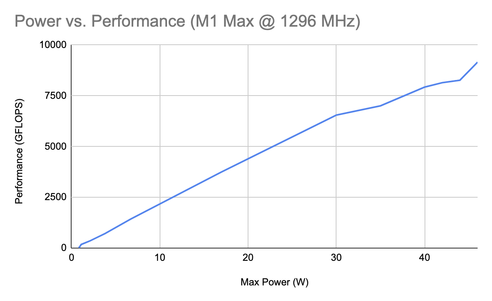

# Metal Benchmarks

Test suite to measure microarchitectural details of the M1 GPU. These details include latencies for each ALU assembly instruction, threadgroup memory bandwidth, and the number of unique instruction pipelines. This information will enable evidence-based reasoning about performance on the M1 GPU. This repository also compares the M1 to generations of AMD and Nvidia microarchitectures. Finally, it examines how Apple's design choices improve power efficiency compared to other vendors.

## Layout of an M1 GPU Core

| Per Core | Apple 7 | Apple 8 | GCN 5 | RDNA 1, 2 | RDNA 3 | Pascal | Turing | Ampere, Ada |
| -------- | ------- | ------- | ----- | --------- | ------ | ------ | ------ | ----------- |
| ALUs | 128 | 128 | 64 | 64 | 128 | 128 | 64 | 128 |
| FP16/FP32 Ratio | 1 | TBD | 2 | 2 | 2 | 1/64 | 2 | 1 | 1 |
| FP64/FP32 Ratio (Native) | 0 | 0 | 1/16 | 1/16 | 1/16 | 1/32 | 1/32 | 1/64 |
| Transcendental/ALU FLOPS | TBD | TBD | TBD | 1/8 | TBD | 1/8 | 1/8 | 1/16 |
| Int16/Int32 Ratio | 1 | TBD | 2 | 2 | 2 | 0 | 0 | 0

| Per Core | Apple 7 | Apple 8 | GCN 5 | RDNA 1, 2 | RDNA 3 | Pascal | Turing | Ampere, Ada |
| -------- | ------- | ------- | ----- | --------- | ------ | ------ | ------ | ----------- |
| Max Threads (Occupancy) | 768-3072 | 768-3072 | 256-2560 | 256-2560 | 384-TBD | 256-2048 | 256-1024 | 256-1536 |
| Register File | 384 KB | 384 KB | 256 KB | 256 KB | 384 KB | 256 KB | 256 KB | 256 KB |
| Shared Memory | 64 KB | 64 KB | 64 KB | 128 KB | 128 KB | 96 KB | 32-64 KB | 8-100 KB |
| L1 Instruction Cache | 12 KB | 12 KB | 32 KB | 32 KB | 32 KB | 8 KB | 12 KB | 32 KB |
| L1 Data Cache | ~8-12 KB | TBD | 16 KB | 16 KB | 32 KB | 24-48 KB | 32-64 KB | 28-128 KB |

## Instruction Throughputs

If listed with a comma, throughputs differ between Apple 7 and Apple 8.

| Float Cycles (M1, A15) | Throughput | Latency | Concurrency |
| -------------------------- | ------ | ------- | ----------- |
| FADD16 |
| FMUL16 |
| FFMA16 |
| FADD32 | 1, TBD |
| FMUL32 | 1, TBD |
| FFMA32 | 1, TBD |
| ROUND |
| RECIP |
| FDIV |
| RSQRT |
| SQRT |
| SIN |
| COS |
| EXP2 |
| LOG2 |
| FMAX |
| FMIN |
| FCMPSEL |

| Int Cycles (M1, A15) | Throughput | Latency | Concurrency |
| ------------------------ | ------ | ------- | ----------- |
| IADD16 |
| IMUL16 |
| IMAD16 |
| IADD32 | 1, TBD |
| IMUL32 | 2 - 2.33 ???, TBD |
| IMAD32 | 3 - 3.67 ???, TBD |
| IMADHI32 | 8, TBD |
| IMAD (32x32+??->64) | 11, TBD |
| IADD64 | 4, TBD |
| BITSHIFT32 |
| BITEXTRACT32 |
| BITWISE32 |
| BITREV32 |
| POPCOUNT32 |
| IMAX32 |
| IMIN32 |
| ICMPSEL32 |

| Multiple Instructions (M1, A15) | Throughput | Latency | Concurrency |
| ------------------------------- | ------ | ------- | ----------- |
| IMUL64 | 13.4 ???, TBD |
| IMULHI64 |
| BITSHIFT64 |
| BITEXTRACT64 |
| BITWISE64 |
| BITREV64 |
| POPCOUNT64 |
| IMAX64 |
| IMIN64 |
| ICMPSEL64 |
| 3 FFMA32 + IADD64 |
| 3 IADD32 + IADD64 |
| 3 IMUL16 + 2 IADD64 |
| Precise RECIP |
| Precise FDIV |
| Precise RSQRT |
| Precise SQRT |
| Precise SIN |
| Precise COS |
| Precise EXP2 |
| Precse LOG2 |
| FMAX3 |
| FMIN3 |
| FMEDIAN |

The Apple GPU does not have dual-dispatch for F32 and I32, like Nvidia does. F16/I16 arithmetic is not faster than 32-bit counterparts. Not sure whether FMA has 3 or 4-cycle latency. Some bad integer multiply benchmarks had cycle throughputs as multiples of 1/3 (2.00, 2.33, 2.67), but potentially because of a 4-instruction recurring register dependency (4 - 1). Command concurrency benchmarks suggest latency must be divisible by 2; the ALU can pipeline up to 2 FMAs from the same SIMD-group simultaneously. The result is exactly half the peak performance of one GPU core. That would mean 4-cycle latency with 4x concurrency, the same scheme used in Firestorm CPU cores and Nvidia GPUs.

This analysis suggests an ALU has four concurrent pipelines. Each can execute either F32 or I32 math; both data types might share the same circuitry. 64-bit integer operations are one instruction in assembly code, but 4-6x slower than 32-bit integer ops. This is similar to the Apple AMX, where 64-bit floats are 4x slower than 32-bit floats because they don't have dedicated circuitry. Also like the AMX, F16 is neither faster nor slower than F32. F16 mostly decreases register pressure, which increases occupancy and therefore ALU utilization. The AMD GPU also has Int64 math running 4x slower than Int32, possibly with better multiply throughput than Apple. Nvidia emulates it.

TODO: graph of FLOPS vs. occupancy, various instructions, once for float/half and int/short

## Register Cache

In low-occupancy situations, or situations with heavy register dependencies, F16/I16 is significantly faster than F32/I32. For back-to-back dependent FMUL, there's a ~1-cycle throughput penalty for a 32-bit register dependency (1.84 total). When switching to a 16-bit register, that's a ~0.5-cycle throughput penalty (1.56 total). In a minimum-occupancy situation, combined latencies are 6.6 and 3.9 cycles. Now it makes sense why Apple pushes for half-precision in Metal.

| ILP | Occupancy | Instruction | FP32 Cycles | FP16 Cycles |
| - | - | - | - | - |
| 1 | 4 simds/core | FMUL, FADD | 6.60 | 3.92 |
| 2 | 4 simds/core | FMUL, FADD | 5.59 | 2.49 |
| 3 | 4 simds/core | FMUL, FADD | 5.14 | 2.55 |
| 4 | 4 simds/core | FMUL, FADD | 2.86 | 1.78 |
| 1 | 8 simds/core | FMUL, FADD | 3.44 | 2.16 |
| 2 | 8 simds/core | FMUL, FADD | 3.08 | 1.46 |
| 3 | 8 simds/core | FMUL, FADD | 2.78 | 1.47 |
| 4 | 8 simds/core | FMUL, FADD | 1.58 | 1.26 |
| 1 | 88 simds/core | FMUL, FADD | 1.84 | 1.56 |
| 2 | 88 simds/core | FMUL, FADD | 1.73 | 1.05 |
| 3 | 88 simds/core | FMUL, FADD | 1.37 | 1.04 |
| 4 | 88 simds/core | FMUL, FADD | 1.01 | 1.02 |

| ILP | Occupancy | Instruction | FP32 Cycles | FP16 Cycles |
| - | - | - | - | - |
| 1 | 4 simds/core | FFMA | | |
| 2 | 4 simds/core | FFMA | | |
| 3 | 4 simds/core | FFMA | | |
| 4 | 4 simds/core | FFMA | | |
| 8 | 4 simds/core | FFMA | | |

| ILP | Occupancy | Instruction | Int32 Cycles | Int16 Cycles |
| - | - | - | - | - |
| 1 | 4 simds/core | IADD | | |
| 2 | 4 simds/core | IADD | | |
| 3 | 4 simds/core | IADD | | |
| 4 | 4 simds/core | IADD | | |

_ILP stands for instruction-level parallelism. It is the number of operations you could theoretically execute in parallel, on a superscalar processor._

## Power Efficiency

TODO: less/slower? threadgroup memory, power varying with clock speed

The M1 Max has 32 GPU cores, but can perform up to 96 compute commands simultaneously. The A15 has slightly more the concurrency, performing 20 commands on 5 GPU cores. In comparison, all Nvidia GPUs top out at 128 concurrent commands. To reach the same concurrency, an Nvidia GPU must have at most 32-42 SMs. This is true for the RTX 3060, but not for more powerful GPUs. While the concurrency seems excessive for the purpose of multitasking, it has another purpose. Say that one task requires resources from 22 GPU cores, and another requires resources from 11. A naive GPU design would only permit 4 concurrent commands. That would allocate 16 GPU cores to the first task and 8 to the second, wasting the other 8. Apple's design lets you divide work more finely.

There's one more usage. The hypothetical workload divides evenly among 33 GPU cores, but we have 32. You could reimagine each task as requiring 32/33x the resources, but the new resource requirements are fractions. With the M1 GPU, you can divide an individual core into fractions. That drastically reduces the load imbalance between tasks 1 and 2. This benefit is most useful on A-series chips with only 3-5 GPU cores to subdivide. For the Mac, it's overkill but contributes to incredible (power) efficiency. I don't know whether the A15 has greater (4/3x) concurrency because it's from the Apple8 generation, or because it's an A-series GPU.

This sub-core concurrency only happens among commands within the same `MTLComputeCommandEncoder`. For commands on different Metal command queues, there's only 2x concurrency across the entire GPU. This makes it similar to early dual-core CPUs, designed in part to be more responsive. Even if a background task is taking several frames, a high-priority UI command can quickly seize half the GPU cores. Beyond that purpose, there's little motive to create any circuitry for 3+ concurrent command queues.

## References

https://github.com/dougallj/applegpu

https://www2.eecs.berkeley.edu/Pubs/TechRpts/2016/EECS-2016-143.pdf

https://rosenzweig.io/blog/asahi-gpu-part-4.html

https://developer.apple.com/metal/Metal-Feature-Set-Tables.pdf

https://github.com/AsahiLinux/docs/wiki/HW:AGX

https://arxiv.org/pdf/1804.06826.pdf

https://arxiv.org/pdf/1905.08778.pdf

https://github.com/dougallj/applegpu/issues/21

https://chipsandcheese.com/2022/05/21/igpu-cache-setups-compared-including-m1/

## US Patents

 

Patents that may reveal design characteristics of the Apple GPU

  
https://www.freepatentsonline.com/y2019/0057484.html

https://patents.justia.com/patent/9633409

https://patents.justia.com/patent/9035956

https://patents.justia.com/patent/20150070367

https://patents.justia.com/patent/9442706

https://patents.justia.com/patent/9508112

https://patents.justia.com/patent/9978343
  
https://patents.justia.com/patent/9727944
 
https://patents.justia.com/patent/10114446

## GPU Configurations

M1 (7-core): https://gist.github.com/IMS212/04d2a96a06eb2c8062029e5680d144f6

M1 (8-core): https://gist.github.com/tommythorn/0ba150bd7a377a6bed4443f412825e20

M1 Pro (14-core): https://gist.github.com/useraccessdenied/60e211cc13f6986867b6a43ad08fd798

M1 Max (32-core): https://gist.github.com/philipturner/48c72e3fcce0ce9489071eb083a5086e
